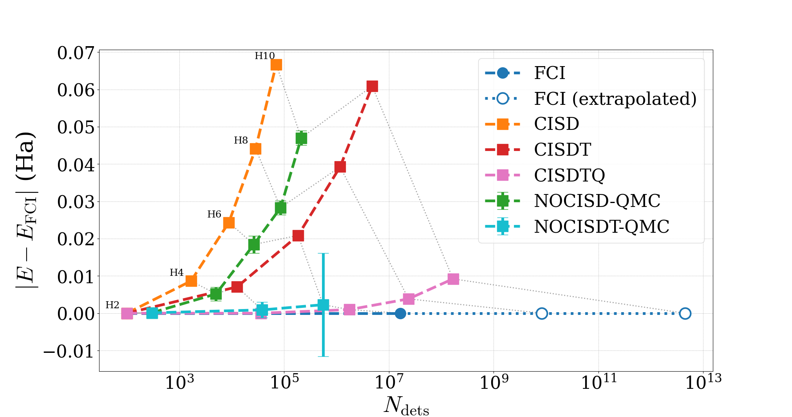
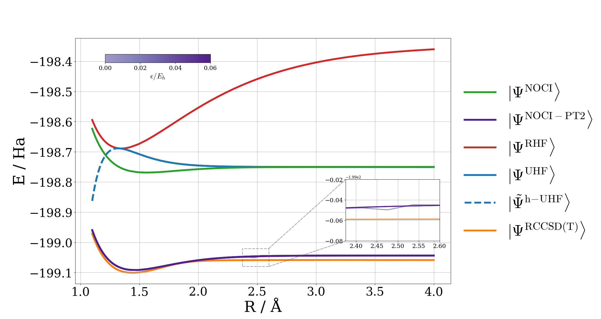
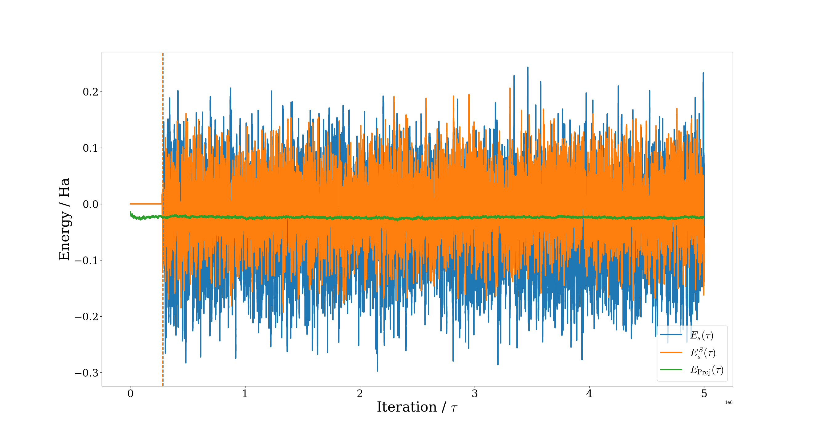

<p align="center">
  
</p>

<h1 align="center">noci-rs</h1>

<p align="center">
  Nonorthogonal electronic-structure methods in Rust.
</p>

<p align="center">
  <a href="https://github.com/dy-cl/noci-rs/actions/workflows/tests.yml">
    
  </a>
  <a href="https://github.com/dy-cl/noci-rs/actions/workflows/clippy.yml">
    
  </a>
  <a href="https://codecov.io/gh/dy-cl/noci-rs">
    
  </a>
</p>

<p align="center">
  <a href="#example-results">Results</a> ·
  <a href="#quick-start">Quick start</a> ·
  <a href="#methods">Methods</a> ·
  <a href="#input-reference">Input reference</a> ·
  <a href="#citation">Citation</a>
</p>

---

`noci-rs` is an electronic-structure package for calculations in nonorthogonal determinant spaces. It supports reference nonorthogonal configuration interaction calculations, NOCI-PT2 corrections, selected NOCI calculations, and stochastic NOCI-QMC propagation. Experimental nonorthogonal coupled-cluster and NOCCMC methods are also under development.

The package uses PySCF to generate molecular integrals and provides RHF and UHF reference-state generation through maximum-overlap methods, SCF metadynamics, and holomorphic continuation. Nonorthogonal matrix elements are evaluated using the generalised Slater–Condon rules, the extended nonorthogonal Wick's theorem, or orthogonal shortcuts where possible. Shared-memory parallelism is available through Rayon and distributed-memory parallelism via MPI, and both may be used with NOCI-QMC and SNOCI/NOCI-PT2.

## Example Results

<p align="center">
  
</p>

<p align="center">
  <em>
    Absolute correlation-energy error relative to FCI, |E<sub>corr</sub> − E<sub>corr</sub><sup>FCI</sup>|, as a function of determinant count for linear H<sub>n</sub> chains (n = 2, 4, 6, 8, 10) in the cc-pVDZ basis at an interatomic separation of 1.5 Å. NOCISD(3)-QMC and NOCISDT(3)-QMC improve upon truncated CI calculations of comparable excitation rank.
  </em>
</p>

<p align="center">
  
</p>

<p align="center">
  <em>
    NOCI-PT2(3) calculation for F<sub>2</sub> in the cc-pVDZ basis. The NOCI-PT2 method recovers much of the dynamical correlation absent from reference NOCI, shown by good agreement with the CCSD(T) energies.
  </em>
</p>

<p align="center">
  
</p>

<p align="center">
  <em>
    Typical evolution of the projected energy, overlap-transformed shift, and non-overlap-transformed shift in a LiH/cc-pVDZ NOCISD(3)-QMC calculation at 2.8 Å.
  </em>
</p>

The corresponding input files are available in [`inputs/examples/`](inputs/examples/).

## Project Status

> [!IMPORTANT]
> `noci-rs` is research software under active development. Input formats, numerical interfaces, and experimental methods may change.

## Quick Start

### Requirements

- Rust 1.90.0 with Cargo. The repository's `rust-toolchain.toml`
  automatically selects this toolchain when using `rustup`.
- Python 3 with PySCF, NumPy, and h5py.
- HDF5 development libraries compatible with the `hdf5` Rust crate.
- OpenBLAS and LAPACK.
- An MPI compiler and runtime.

### Build

```bash
git clone https://github.com/dy-cl/noci-rs
cd noci-rs
cargo build --release
```

Detailed timing counters can be enabled with:

```bash
cargo build --release --features timings
```

> [!WARNING]
> Do not currently build using `--features nocc` or `--all-features` unless developing the experimental NOCC implementation. Compile-time generation of the NOCC overlap and residual terms can take a substantial amount of time. This is currently being optimised.

### Run

For one MPI rank with a specified number of Rayon worker threads:

```bash
RAYON_NUM_THREADS=X ./target/release/noci-rs input.lua > output.out
```

For distributed-memory execution in combination with Rayon:

```bash
RAYON_NUM_THREADS=X mpirun -np X ./target/release/noci-rs input.lua > output.out
```

Example inputs are provided under [`inputs/`](inputs/).

### Minimal Reference NOCI Example

```lua
-- Stretched H2 geometry with multireference character.
mol = {
    basis = "cc-pVDZ",
    r = 1.5,
    unit = "Ang",
    atoms = function(r)
        return {
            string.format("H 0 0 %g", -r / 2),
            string.format("H 0 0 %g",  r / 2),
        }
    end,
}

-- Use MOM to obtain the RHF state and two symmetry-broken UHF states.
states = {
    mom = {
        {
            label = "RHF",
            noci = true,
        },
        {
            label = "UHF (+, -)",
            spin_bias = {
                pattern = {1, -1},
                pol = 0.75,
            },
            noci = true,
        },
        {
            label = "UHF (-, +)",
            spin_bias = {
                pattern = {-1, 1},
                pol = 0.75,
            },
            noci = true,
        },
    },
}
```

Run this input with:

```bash
RAYON_NUM_THREADS=X mpirun -np X ./target/release/noci-rs inputs/examples/h2.lua > output.out
```

## Methods

### SCF-State Generation

- RHF and UHF SCF solutions with DIIS acceleration.
- MOM state recipes using spin-density bias, spatial-density bias, and occupied–virtual excitation seeds.
- SCF metadynamics for discovering multiple RHF and UHF solutions.
- Holomorphic SCF optimisation for complex continuations of selected MOM states.
- Geometry scans that reuse converged states as guesses at subsequent geometries.

### Nonorthogonal Configuration Interaction

- Reference NOCI using selected real or holomorphic SCF states.
- Hamiltonian, overlap, and generalised Fock matrix construction.
- Generalised Slater–Condon, extended nonorthogonal Wick's theorem, and orthogonal matrix-element implementations.
- Wick's intermediates stored in memory or using a disk-backed cache.

### Selected NOCI and NOCI-PT2

- Iterative candidate generation and determinant selection.
- NOCI-PT2 candidate scoring and perturbative energy corrections.
- GMRES solution of projected candidate-space equations.
- Diagonal and Woodbury preconditioners.
- Optional imaginary shifts.
- Can use holomorphic SCF states.

### NOCI-QMC

- Deterministic imaginary-time propagation with an optional dynamic shift.
- Signed-walker stochastic propagation for shifted and difference-doubly-shifted propagators.
- Direct-overlap stochastic propagation using a real metric population \(N_w = S_{wx}c_x\).
- Uniform and heat-bath excitation generators.
- Various propagators for nonorthogonal and overcomplete spaces.
- MPI and Rayon parallelism.
- Currently only supports real SCF states.

### Parallelism

- Rayon-parallel determinant-pair matrix-element evaluation when constructing a full matrix.
- MPI parallelism for stochastic propagation and distributed NOCI-PT2 and SNOCI calculations.
- Shared-memory Rayon parallelism within each MPI process for stochastic propagation and NOCI-PT2/SNOCI calculations.
- Shared-memory Wick's theorem intermediates across MPI ranks on each node.

### Output and Restart Support

- Text reports for SCF, reference NOCI, SNOCI, NOCI-PT2, and stochastic propagation.
- Optional detailed timing counters when built with the `timings` feature.
- Optional HDF5 orbital output.
- Optional plain-text Hamiltonian and overlap matrices.
- Deterministic coefficient and excitation-histogram output.
- Stochastic restart input and output.


## Input Reference

Input files are Lua scripts.

The required top-level tables are:

- `mol`: molecular geometry, basis set, units, and scan coordinates.
- `states`: MOM state recipes or SCF metadynamics settings.

The optional top-level tables are:

- `scf`: conventional and holomorphic SCF convergence settings.
- `excit`: excitation orders for SNOCI and NOCI-QMC spaces.
- `prop`: timestep and propagator shared by deterministic and stochastic propagation.
- `det`: deterministic propagation.
- `qmc`: stochastic NOCI-QMC.
- `snoci`: selected NOCI and NOCI-PT2.
- `write`: optional output files and restart settings.
- `wicks`: extended nonorthogonal Wick settings.

### Molecule

The `mol` table defines the molecular geometry, basis set, units, and optional geometry scan. `mol.r` may be a single number or a Lua table of scan points. `mol.atoms` may be a static table of atom strings or a function of `r`.

```lua
mol = {
    basis = "cc-pVDZ",
    r = {0.8, 1.0, 1.2},
    unit = "Ang",
    atoms = function(r)
        return {
            string.format("H 0 0 %g", -r / 2),
            string.format("H 0 0 %g",  r / 2),
        }
    end,
}
```

### SCF

The optional `scf` table controls convergence of conventional RHF and UHF calculations together with the quasi-Newton optimisation used for holomorphic SCF states.

```lua
scf = {
    max_cycle = 1e5,
    e_tol = 1e-12,
    fds_sdf_tol = 1e-8,
    d_tol = 1e-4,
    do_fci = false,

    diis = {
        space = 8,
    },

    h = {
        max_cycle = 1e2,
        g_tol = 1e-10,
        sr1_tol = 1e-12,
        denom_tol = 1e-10,
        max_step = 5e-1,
        line_steps = 1e1,
        line_shrink = 5e-1,
        history = 2e1,
    },
}
```

The outer entries control conventional SCF convergence. The nested `scf.h` table controls holomorphic SCF optimisation, including the gradient threshold, SR1 updates, maximum orbital-rotation step, backtracking line search, and optimisation history.

### States

MOM recipes support `spin_bias`, `spatial_bias`, `excit`, `noci`,
`holomorphic`, and `partner`.

```lua
states = {
    mom = {
        {
            label = "RHF",
            noci = true,
        },
        {
            label = "UHF (+, -)",
            spin_bias = {
                pattern = {1, -1},
                pol = 0.75,
            },
            noci = true,
        },
        {
            label = "UHF (-, +)",
            spin_bias = {
                pattern = {-1, 1},
                pol = 0.75,
            },
            noci = true,
        },
        {
            label = "h-UHF (+, -)",
            holomorphic = true,
            spin_bias = {
                pattern = {1, -1},
                pol = 0.75,
            },
            partner = "UHF (+, -)",
            noci = true,
        },
        {
            label = "h-UHF (-, +)",
            holomorphic = true,
            spin_bias = {
                pattern = {-1, 1},
                pol = 0.75,
            },
            partner = "UHF (-, +)",
            noci = true,
        },
    },
}
```

SCF metadynamics may be used instead of explicitly specified MOM recipes:

```lua
states = {
    metadynamics = {
        nstates_rhf = 1,
        nstates_uhf = 2,
        spinpol = 0.75,
        spatialpol = 0.75,
        lambda = 0.5,
        max_attempts = 1e2,
    },
}
```

This avoids requiring *a priori* knowledge of the SCF states.

### Excitations

The `excit` table defines the excitation orders used to construct post-reference determinant spaces for deterministic and stochastic NOCI-QMC calculations and for SNOCI candidate generation.

```lua
excit = {
    orders = {1, 2},
}
```

Use `excit.all = true` instead of `orders` to generate every supported excitation order.

### Propagation

The `prop` table specifies the imaginary-time timestep and propagator used by deterministic or stochastic NOCI-QMC calculations. It is required when either the `det` or `qmc` table is present.

```lua
prop = {
    dt = 1e-4,
    propagator = "difference-doubly-shifted-u2",
}
```

Available propagators are:

- `unshifted`
- `shifted`
- `doubly-shifted`
- `difference-doubly-shifted-u1`
- `difference-doubly-shifted-u2`
- `direct-overlap`

### Deterministic Propagation

The `det` table enables deterministic imaginary-time propagation over the generated excitation space by constructing the full Hamiltonian and overlap matrices.

```lua
det = {
    max_steps = 1e5,
    dynamic_shift = true,
    dynamic_shift_alpha = 1e-1,
    e_tol = 1e-10,
}
```

These options control the maximum number of propagation steps, convergence threshold, and optional dynamic population shift.

### Stochastic Propagation

The `qmc` table enables stochastic imaginary-time propagation. Shifted and difference-doubly-shifted propagators use the signed-walker population representation. The `direct-overlap` propagator uses a real metric population \(N_w = S_{wx}c_x\) and Fast Randomized Iteration-style compression to sample sparse spawning populations.

```lua
qmc = {
    initial_population = 1e2,
    target_population = 1e5,
    shift_damping = 5e-4,
    ncycles = 1e1,
    nreports = 1e3,
    sampling_cutoff = 1.0,
    spawn_cutoff = 0.25,
    excitation_gen = "uniform",
    seed = 92774801300236626,
}
```

Available excitation generators are:

- `uniform`
- `heat-bath`

Exact heat-bath sampling is very expensive.

For `direct-overlap`, `sampling_cutoff` controls the stochastic compression threshold used to sample the persistent metric population, and `spawn_cutoff` controls the stochastic compression threshold for generated population changes.

### Selected NOCI and NOCI-PT2

The `snoci` table enables iterative selected NOCI calculations. Excited determinants are generated from the orders specified in `excit`, scored using their NOCI-PT2 contributions, and added to the variational NOCI space.

```lua
snoci = {
    sigma = 1e-6,
    tol = 1e-8,
    max_iter = 1e2,
    max_add = 5e0,
    max_dim = 1e2,
    preconditioner = "woodbury",
    imag_shift = {
      0.0
    },

    gmres = {
        max_iter = 1e2,
        restart = 2e2,
        res_tol = 1e-8,
        metric_tol = 1e-8,
        full_m = true,
    },
}
```

A NOCI-PT2-only calculation may be performed by limiting the selected NOCI procedure to one iteration. Although arbitrary excitation orders are currently accepted, the rigorous NOCI-PT2 first-order interacting space consists of single and double excitations.

### Output

The `write` table controls optional output files, restart files, and the amount of information printed during a calculation.

```lua
write = {
    verbose = true,
    write_dir = "outputs/",
    write_orbitals = false,
    write_matrices = false,
    write_deterministic_coeffs = false,
    write_excitation_hist = false,
    write_restart = nil,
    write_restart_interval = nil,
    read_restart = nil,
}
```

Orbital data are written in HDF5 format. Hamiltonian and overlap matrices are written as plain text. Stochastic calculations can read and write restart files. If `write_restart_interval` is set, a restart file is written every `write_restart_interval` stochastic iterations, and `write_restart_interval` must be divisible by `qmc.ncycles`.

### Wick's Intermediates

The `wicks` table controls evaluation and storage of intermediates used by the extended nonorthogonal Wick's theorem.

```lua
wicks = {
    enabled = true,
    compare = false,
    storage = "ram",
    cachedir = ".",
}
```

Set `storage = "disk"` to use a disk-backed cache. When `compare = true`, Wick-based matrix elements are checked against the generalised Slater–Condon implementation.

### Defaults

Defaults are defined by the input structures under
[`src/input/`](src/input/).

## Citation

`noci-rs` is not yet associated with a dedicated software publication. Until one is available, cite the repository and the relevant method publications listed below.

### Method References

1. Tracy P. Hamilton and Peter Pulay. Direct inversion in the iterative subspace optimisation of open-shell, excited-state, and small multiconfiguration SCF wave functions. *The Journal of Chemical Physics* **84**, 5728–5734 (1986).

2. Alex J. W. Thom and Martin Head-Gordon. Locating multiple self-consistent field solutions: An approach inspired by metadynamics. *Physical Review Letters* **101**, 193001 (2008).

3. Andrew T. B. Gilbert, Nicholas A. Besley, and Peter M. W. Gill. Self-consistent field calculations of excited states using the maximum overlap method. *The Journal of Physical Chemistry A* **112**, 13164–13171 (2008).

4. István Mayer. *Simple Theorems, Proofs, and Derivations in Quantum Chemistry*. Springer (2003).

5. Hugh G. A. Burton. Generalized nonorthogonal matrix elements II: Extension to arbitrary excitations. *The Journal of Chemical Physics* **157**, 204109 (2022).

6. Adam A. Holmes, Hitesh J. Changlani, and C. J. Umrigar. Efficient heat-bath sampling in Fock space. *Journal of Chemical Theory and Computation* **12**, 1561–1571 (2016).

7. Samuel M. Greene, Robert J. Webber, Jonathan Weare, and Timothy C. Berkelbach. Beyond walkers in stochastic quantum chemistry: Reducing error using fast randomized iteration. *Journal of Chemical Theory and Computation* **15**, 4834–4850 (2019).

8. Hugh G. A. Burton and Alex J. W. Thom. Reaching full correlation through nonorthogonal configuration interaction: A second-order perturbative approach. *Journal of Chemical Theory and Computation* **16**, 5586–5600 (2020).

## Licence

This project is distributed under the terms given in [`LICENSE`](LICENSE).
